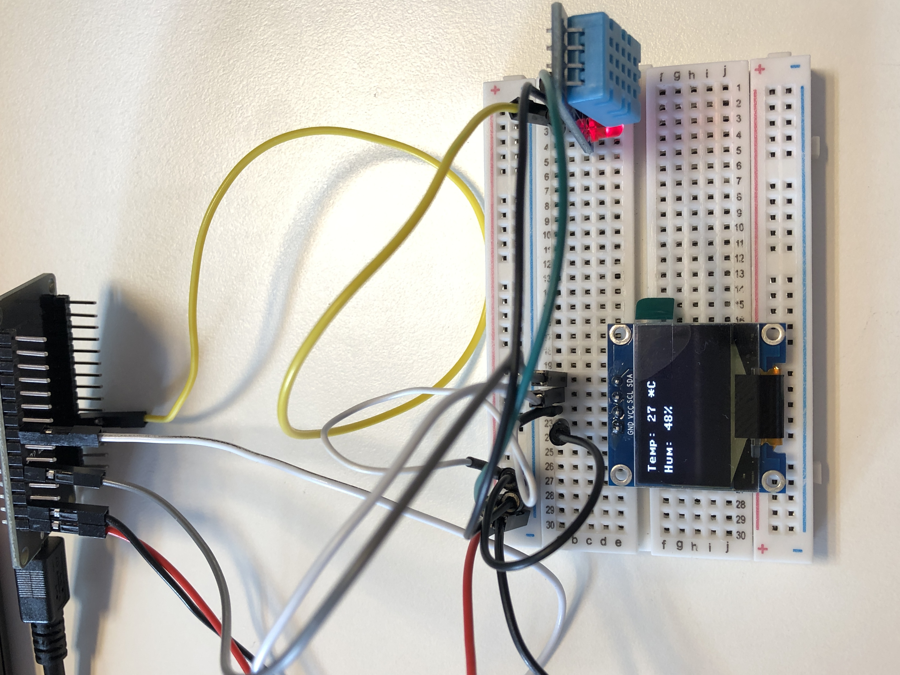

# Masurare temperatura si umiditate + OLED
Programul, scris in Micropython, are rolul de a masura temperatura si umiditatea aerului folosind DHT11 si afisarea datelor pe un display OLED.

## Detalii tehnice

### ESP32
- CPU: Xtensa dual-core
- Performanta: 160 or 240 MHz si pana la 600 DMIPS
- Memorie: 520 KiB SRAM
- Bluetooth: V4.2 BR/EDR & BLE
- Wi-Fi: 802.11 b/g/n
- Power: 5uA deep sleep

### DHT11
 &nbsp; | Umiditate | Temperatura
--- | --- | ---
Rezolutie | 0.1% | 0.1% 16bit
Range | 20-95% | 0 +60°C
Precizie | ± 5% | ± 2 °C
Tensiune de lucru | 2.7-5.5VDC | 2.7-5.5VDC
Consum | 60uA-8mA | >60uA-8mA
Comunicare | 1 fir digital | 1 fir digital

### OLED
- Diagonala ecran: 0.96”
- Numar de pixeli: 128 x 64
- Display: monocrom
- Luiminozitate(cd/m2): 150(Typ) @ 7.25V
- Interfață: I2C

## Poza proiect

### Pin wiring

DHT11 | OLED
--- | ---
**OUT**: GPIO 14 | **SDA**: GPIO 4
&nbsp; | **SCL**: GPIO 5

## Link resurse
- [DHT11](https://www.xab3.ro/produse/modul-electronic-cu-senzor-dht-11)
- [ESP32](https://www.xab3.ro/produse/esp32-devkit-wh)
- [OLED](https://www.xab3.ro/produse/oled-096-128x64-i2c)