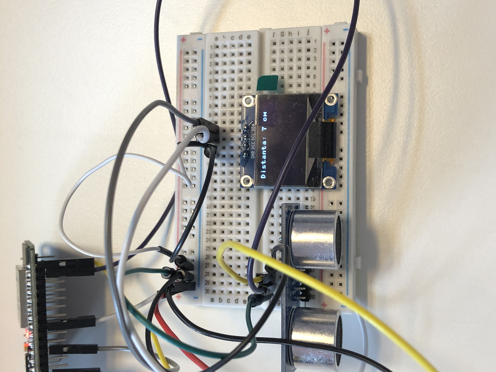

# Senzor de distanta ultrasonic HC-SR04 5V&3V si OLED 0.96 inch 128x64 I2C

## Descriere produs
Proiectul are scopul de a masura distanta dintre senzor si un obiect si afisarea acestuia pe un display OLED.

## Detalii tehnice

### HC-SR04 
- Tensiune de alimentare: 3.3-5V 
- Consum: 2-5mA
- I/O raspuns: 10µs
- Frecventa: 40khz
- Distanta masurabila: 2-200cm

### OLED 0.96 inch I2C
- Display: 7mm x 25mm
- Diagonala ecran: 0.96”
- Numar de pixeli: 128 x 64
- Luiminozitate(cd/m2): 150(Typ) @ 7.25V
- Interfață: I2C

### ESP32
- CPU: Xtensa dual-core
- Performanta: 160 or 240 MHz si pana la 600 DMIPS
- Memorie: 520 KiB SRAM
- Bluetooth: V4.2 BR/EDR & BLE
- Wi-Fi: 802.11 b/g/n
- Power: 5uA deep sleep

## Poza proiect

## Link Resurse
HC-SR04 | OLED I2C | ESP32
--- | --- | ---
[Website](https://www.xab3.ro/produse/senzor-de-distanta-ultrasonic-hc-sr04) | [Website](https://www.xab3.ro/produse/oled-096-128x64-i2c) | [Website](https://www.xab3.ro/produse/esp32-devkit-wh)
[hcsr04.py](https://github.com/rsc1975/micropython-hcsr04) | [ssd1306.py](https://docs.micropython.org/en/latest/esp8266/tutorial/ssd1306.html) | -